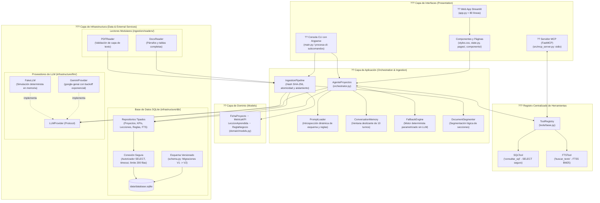

# ���� Agente de Consulta de Proyectos 路 Procesa Consultores
> **Sistema de Inteligencia Operativa y Consulta Documental Multi-Herramienta con Arquitectura Modular Limpia, impulsado por Google Gemini, SQLite Relacional, FTS5, Servidor MCP y Streamlit.**

---

## 1. ���� Contexto de Negocio y Visi贸n General
**"Procesa Consultores"** es una firma de consultor铆a especializada en optimizaci贸n de procesos y mejora de eficiencia operativa. La firma ha ejecutado y cerrado con 茅xito cuatro proyectos emblem谩ticos documentados en informes heterog茅neos (PDF y DOCX) ubicados en `data/raw/`:

1. `Informe_Cierre_PC-2025-014_Cooperativa_Horizonte_Andino.pdf` *(Servicios financieros 路 Cr茅dito)*
2. `Informe_Cierre_PC-2025-027_Plasticos_del_Pacifico.pdf` *(Manufactura 路 TPM y SMED en inyecci贸n)*
3. `Informe_Cierre_PC-2025-033_Clinica_Santa_Lucia.docx` *(Salud 路 Admisi贸n y consulta externa)*
4. `Informe_Cierre_PC-2026-006_Supermercados_La_Canasta.pdf` *(Retail 路 Reposici贸n y cadena de suministro)*

Este repositorio implementa una soluci贸n de nivel empresarial refactorizada hacia una **arquitectura modular limpia** (Domain, Infrastructure, Application e Interfaces) que extrae la informaci贸n t茅cnica de los informes mediante **Google Gemini** con tipado estricto (**Pydantic**), la estructura y persiste en **SQLite** (tablas relacionales normalizadas e 铆ndices de texto completo **FTS5**), y provee un agente orquestador con capacidad de **Function Calling**, trazabilidad transparente de herramientas ejecutadas, **cero alucinaciones**, soporte del protocolo est谩ndar **Model Context Protocol (MCP)** y triple interfaz de usuario: **Web (Streamlit)**, **CLI estructurado** y **Servidor MCP**.

---

## 2. ����锔?Arquitectura del Sistema (Clean Modular Architecture)

El sistema sigue los principios de dise帽o por capas y separaci贸n estricta de responsabilidades:



### Principios Arquitect贸nicos Aplicados:
1. **Desacoplamiento Absoluto de Datos de Negocio:** Ninguna cifra, nombre de cliente ni regla de prevalencia se encuentra escrita en c贸digo Python (`src/`). Todo se lee en tiempo de ejecuci贸n desde SQLite y `data/reglas_negocio.json`.
2. **Definici贸n ��nica de Herramientas (DRY):** `SQLTool` y `FTSTool` se definen una sola vez en `src/procesa_agent/tools/`. El agente, la consola y el servidor MCP consumen din谩micamente este registro.
3. **Seguridad en Profundidad (Defense in Depth):**
   - Autorizador SQLite en C (`sqlite3.set_authorizer`) que bloquea lectura de `configuraciones` y cualquier operaci贸n no autorizada.
   - Parser de validaci贸n l茅xica de sentencias 煤nicas `SELECT`/`WITH`.
   - Timeout forzado de 3,0 s contra DoS de CTEs recursivas.
   - Truncamiento preventivo en 200 filas.
   - Enmascaramiento permanente de claves API en la interfaz web y logs.

---

## 3. ���� Reglas de Negocio Oficiales y Gobernanza de Datos

Las reglas de negocio est谩n formalizadas en `data/reglas_negocio.json` y versionadas en la tabla `reglas_negocio`:

| C贸digo de Regla | ��mbito / Proyecto | Directriz Oficial de Negocio |
| :--- | :--- | :--- |
| `RN-001` | Global | **Prevalencia de la Tabla Oficial de Resultados:** Ante cualquier discrepancia entre anexos/narrativas y la tabla oficial del informe de cierre, **prevalece siempre la tabla oficial**. |
| `RN-002` | Pl谩sticos del Pac铆fico (`PC-2025-027`) | **L铆nea Base de Paradas:** La l铆nea base contractual y anal铆tica es exactamente **`64 h/mes`** (meta `��?38 h/mes`, resultado `31 h/mes`, variaci贸n `-52%`). |
| `RN-003` | Horizonte Andino (`PC-2025-014`) | **No Atribuibilidad:** El incremento de colocaci贸n del `+9%` se origin贸 en una campa帽a comercial externa; **no constituye entregable ni resultado atribuible** a la consultor铆a. |
| `RN-004` | La Canasta (`PC-2026-006`) | **Cerrado con Pendientes:** Aunque finaliz贸 su plazo, es el 煤nico proyecto en estado `Cerrado con pendientes` debido a la no integraci贸n t茅cnica de 3 proveedores cr铆ticos. |
| `RN-005` | Cl铆nica Santa Luc铆a (`PC-2025-033`) | **Alcance Excluido:** Los servicios de Emergencia y Quir贸fanos fueron expl铆citamente excluidos del alcance contractual; las mediciones corresponden 煤nicamente a Consulta Externa y Admisi贸n. |
| `RN-006` | Global | **Variables no Documentadas:** Honorarios de consultor铆a, presupuestos de honorarios o m谩rgenes financieros no constan en los informes de cierre; el sistema declara su no disponibilidad por pol铆tica anti-alucinaci贸n. |
| `RN-007` | Global | **Clientes No Registrados:** Consultas sobre entidades no documentadas (ej. Banco Pichincha) retornan respuesta negativa protocolar sin inferencias. |

---

## 4. ���� Gu铆a de Instalaci贸n y Puesta en Marcha

### Requisitos Previos
- **Sistema Operativo:** Windows 10/11, Linux o macOS.
- **Python:** Versi贸n `>= 3.11` (probado y certificado en Python 3.11, 3.12, 3.13 y 3.14).

### 1. Clonar el Repositorio y Configurar Entorno Virtual
```bash
# Clonar repositorio
git clone <URL_DEL_REPOSITORIO>
cd Agente_de_Proyectos

# Crear entorno virtual aislado
python -m venv venv

# Activar entorno virtual:
# En Windows (PowerShell):
.\venv\Scripts\Activate.ps1
# En Linux / macOS:
source venv/bin/activate
```

### 2. Instalaci贸n en Modo Desarrollo
Instala el paquete `procesa-agent` en modo editable junto con todas sus dependencias de desarrollo y testing:
```bash
pip install --upgrade pip
pip install -e ".[dev]"
```

### 3. Configurar Variables de Entorno (Opcional)
Copia la plantilla `.env.example` a `.env`:
```bash
cp .env.example .env
```
Edita `.env` para a帽adir tu clave:
```env
GEMINI_API_KEY=AIzaSy...tu_clave_aqui
MODEL_NAME=gemini-2.5-flash
TEMPERATURE=0.1
```
*(Nota: Tambi茅n puedes ingresar y guardar tu API Key de forma segura directamente desde la interfaz Web de Streamlit).*

### 4. Ejecutar Pipeline de Ingesta Inicial
Si la base de datos `data/database.sqlite` no existe o deseas sincronizar los documentos de `data/raw/`:
```bash
python main.py ingestar
```
El pipeline calcula el hash SHA-256 de cada archivo en `data/raw/`, omite archivos sin cambios, extrae entidades y las persiste at贸micamente.

---

## 5. ���� Interfaces de Usuario y Modos de Ejecuci贸n

### A. Interfaz Web Interactiva (Streamlit)
La interfaz gr谩fica principal cuenta con un dise帽o corporativo estilo SaaS, visualizaci贸n ejecutiva y cero textos truncados:
```bash
streamlit run app.py
```
**Caracter铆sticas:**
- **Chatbot Consultor:** Di谩logo en lenguaje natural con citas documentales destacadas y trazabilidad completa desplegable de herramientas.
- **Explorador de Datos:** Tablas filtrables de proyectos, lecciones aprendidas y tarjetas de KPIs con deltas de color.
- **Auditor铆a & Par谩metros:** Visualizaci贸n de la tabla `configuraciones` con contrase帽as enmascaradas y panel de diagn贸stico MCP.

---

### B. Interfaz de L铆nea de Comandos (CLI)
Ofrece subcomandos estructurados mediante `argparse`:

```bash
# 1. Ver estado del portafolio y conteos de la base de datos:
python main.py estado

# 2. Realizar una consulta al agente inteligente:
python main.py preguntar "驴Cu谩les fueron los resultados principales de KPIs?" --verbose

# 3. Realizar una consulta en modo local determinista (sin consumo de API):
python main.py preguntar "驴Qu茅 proyectos se cerraron con pendientes y por qu茅?" --modo fallback

# 4. Ejecutar una consulta SQL SELECT directa de solo lectura:
python main.py preguntar "SELECT codigo_proyecto, cliente, estado FROM proyectos;" --modo sql

# 5. Ejecutar la ingesta forzada de documentos:
python main.py ingestar --force

# 6. Modo interactivo conversacional (REPL):
python main.py
```

---

## 6. ���� Servidor MCP (Model Context Protocol) & Gu铆a de Troubleshooting

El servidor MCP expone las capacidades anal铆ticas de la base de datos a clientes de IA como **Claude Desktop**, **Cursor IDE**, **Windsurf** o agentes aut贸nomos.

### Herramientas MCP Expuestas:
- `consultar_sql(query: str)`: Ejecuta consultas anal铆ticas `SELECT` sobre SQLite bajo pol铆ticas de solo lectura.
- `buscar_texto(terminos_busqueda: str)`: B煤squeda de texto completo y sem谩ntico sobre las secciones de informes en FTS5.

---

### ���锔� Troubleshooting Cr铆tico: Aislamiento del Entorno Virtual (`venv`)

#### El Problema
Al integrar el servidor MCP con **Claude Desktop** o **Cursor**, puede presentarse el siguiente error en los logs del cliente:
```text
ModuleNotFoundError: No module named 'mcp'
```

#### Causa Ra铆z
Cuando en el archivo de configuraci贸n del cliente MCP se especifica el comando simplemente como `"python"`, el sistema operativo resuelve el ejecutable global de Python del PATH del sistema (donde `mcp` no est谩 instalado), en lugar del int茅rprete de tu entorno virtual (`venv`), donde reside el paquete.

#### Soluci贸n Definitiva
Debes especificar la **ruta absoluta completa** al ejecutable `python` dentro de tu entorno virtual `venv`:

#### 1. Configuraci贸n para Claude Desktop
Ruta del archivo en Windows: `%APPDATA%\Claude\claude_desktop_config.json`  
Ruta en macOS: `~/Library/Application Support/Claude/claude_desktop_config.json`

```json
{
  "mcpServers": {
    "procesa-consultores": {
      "command": "C:\\Users\\edwal\\Downloads\\Prueba Valor\\Agente_de_Proyectos\\venv\\Scripts\\python.exe",
      "args": [
        "C:\\Users\\edwal\\Downloads\\Prueba Valor\\Agente_de_Proyectos\\src\\mcp_server.py"
      ]
    }
  }
}
```

#### 2. Configuraci贸n para Cursor IDE / Windsurf
Crea o edita `.cursor/mcp.json` en la ra铆z de tu proyecto:
```json
{
  "mcpServers": {
    "procesa-consultores": {
      "command": "C:\\Users\\edwal\\Downloads\\Prueba Valor\\Agente_de_Proyectos\\venv\\Scripts\\python.exe",
      "args": [
        "C:\\Users\\edwal\\Downloads\\Prueba Valor\\Agente_de_Proyectos\\src\\mcp_server.py"
      ]
    }
  }
}
```

---

## 7. ���� Compatibilidad de Modelos LLM (Google Gemini)

El sistema soporta la familia oficial de Google GenAI con conmutaci贸n din谩mica:

| Modelo | Identificador API | Rol ��ptimo en el Sistema | Latencia T铆pica |
| :--- | :--- | :--- | :--- |
| **Gemini 2.5 Flash** | `gemini-2.5-flash` | **Predeterminado de Producci贸n:** Excelente balance costo-beneficio para Function Calling y respuestas anal铆ticas inmediatas. | < 1,0 s |
| **Gemini 3.5 Flash** | `gemini-3.5-flash` | **Pr贸xima Generaci贸n:** Proyectado para mayor razonamiento sint茅tico con costo ultrabajo. | < 0,9 s |
| **Gemini 3.8 Flash** | `gemini-3.8-flash` | **Alta Capacidad:** Procesamiento simult谩neo de m煤ltiples documentos completos o anexos densos. | ~1,2 s |
| **Gemini 1.5 Pro** | `gemini-1.5-pro` | **Tier Anal铆tico Avanzado:** Razonamiento profundo transversal para comit茅s directivos y auditor铆as complejas. | ~2,5 s |

---

## 8. ��И Suite de Pruebas Automatizadas y CI/CD

El repositorio cuenta con una suite completa de **48 pruebas automatizadas** con **aislamiento absoluto** de la base de datos de producci贸n mediante fixtures ef铆meras en `tmp_path`. Ning煤n test modifica `data/database.sqlite`.

### Ejecuci贸n de Pruebas:
```bash
# Ejecutar suite aislada sin requerir API key ni red:
python -m pytest -m "not live" -v

# Ejecutar con reporte de cobertura de c贸digo:
python -m pytest -m "not live" --cov=procesa_agent --cov-report=term-missing
```

### Verificaci贸n de Estilo y Tipado:
```bash
# Linting y formateo con Ruff:
python -m ruff check .
python -m ruff format --check .

# An谩lisis est谩tico de tipos con Mypy:
python -m mypy src/procesa_agent
```

### Integraci贸n Continua (CI):
El flujo de trabajo en `.github/workflows/ci.yml` ejecuta autom谩ticamente las 48 pruebas, el linter `ruff` y el analizador de tipos `mypy` en matrices multiplataforma (**Ubuntu** y **Windows**) para Python **3.11, 3.12, 3.13 y 3.14**.

---

## 9. ���� Modelo de Estimaci贸n de Costos (50 Consultores)

### Escenario de Uso y Supuestos Operativos
- **Equipo de consultor铆a:** 50 consultores activos.
- **Volumen de consultas:** 6 consultas diarias por consultor = **300 queries/d铆a**.
- **Jornada mensual:** 22 d铆as h谩biles = **6.600 queries/mes**.

### Consumo Estimado de Tokens por Consulta
- **Tokens de Entrada (Prompt + Esquema DB + Historial + Resultados Tool):** ~2.000 tokens / query.
- **Tokens de Salida (Respuesta estructurada en lenguaje natural y citas):** ~400 tokens / query.
- **Total Mensual Input:** 6.600 �� 2.000 = 13.200.000 tokens (**13,2 M tokens**).
- **Total Mensual Output:** 6.600 �� 400 = 2.640.000 tokens (**2,64 M tokens**).

---

### Tarifario y Comparativa de Costos por Modelo de API

| Concepto | Gemini 2.5 / 1.5 Flash | Gemini 3.5 Flash *(Proyectado)* | Gemini 3.8 Flash *(High-Capacity)* | Gemini 1.5 / Pro *(Tier Avanzado)* |
| :--- | :--- | :--- | :--- | :--- |
| **Tarifa Input (por 1M tokens)** | $0,075 USD | $0,100 USD | $0,150 USD | $1,250 USD |
| **Tarifa Output (por 1M tokens)** | $0,300 USD | $0,400 USD | $0,600 USD | $5,000 USD |
| **Costo Mensual Input (13,2 M)** | $0,99 USD | $1,32 USD | $1,98 USD | $16,50 USD |
| **Costo Mensual Output (2,64 M)** | $0,79 USD | $1,06 USD | $1,58 USD | $13,20 USD |
| **COSTO TOTAL MENSUAL (50 usuarios)** | **$1,78 USD / mes** | **$2,38 USD / mes** | **$3,56 USD / mes** | **$29,70 USD / mes** |
| **Costo promedio por consultor / mes** | **$0,036 USD** | **$0,048 USD** | **$0,071 USD** | **$0,594 USD** |

---

### An谩lisis y Recomendaci贸n Estrat茅gica

1. **Modelo de Producci贸n Predeterminado (Gemini 2.5 / 3.5 Flash):**
   - Para flujos est谩ndar de Function Calling (traducci贸n a SQL y b煤squedas FTS5), la serie Flash mantiene un costo mensual total inferior a **$2,50 USD para toda la organizaci贸n**.
   - Garantiza tiempos de respuesta inferiores a 1 segundo por interacci贸n sin penalizar el presupuesto operativo.

2. **Modelo de Mayor Contexto / Capacidad (Gemini 3.8 Flash):**
   - Representa un punto de equilibrio 贸ptimo (~**$3,56 USD/mes**) si se incrementa la ventana de contexto para procesar m煤ltiples informes consolidados simult谩neamente o documentos con anexos densos.

3. **Modelo de Escalado Anal铆tico (Gemini Pro):**
   - Configurable directamente desde la interfaz web (Streamlit) mediante la tabla de `configuraciones`.
   - Se reserva bajo demanda para consultas que requieran razonamiento multidocumento complejo, correlaci贸n transversal de lecciones aprendidas o generaci贸n de s铆ntesis ejecutivas extensas, manteniendo un techo controlado de **~$30 USD mensuales**.
