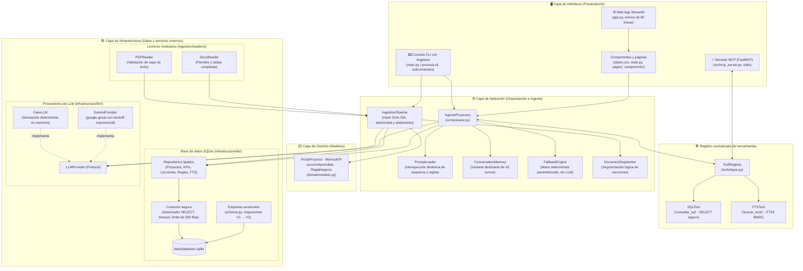

<div align="center">

# 💼 Agente de Consulta de Proyectos
### Procesa Consultores

**Sistema de inteligencia operativa y consulta documental multi-herramienta**
con arquitectura modular limpia


</div>

---

## 📑 Tabla de contenidos

1. [Contexto de negocio](#1--contexto-de-negocio)
2. [Arquitectura del sistema](#2-️-arquitectura-del-sistema)
3. [Reglas de negocio y gobernanza de datos](#3--reglas-de-negocio-y-gobernanza-de-datos)
4. [Instalación y puesta en marcha](#4--instalación-y-puesta-en-marcha)
5. [Interfaces de usuario y modos de ejecución](#5--interfaces-de-usuario-y-modos-de-ejecución)
6. [Servidor MCP y solución de problemas](#6--servidor-mcp-y-solución-de-problemas)
7. [Modelos LLM compatibles](#7--modelos-llm-compatibles)
8. [Pruebas automatizadas y CI/CD](#8--pruebas-automatizadas-y-cicd)
9. [Estimación de costos](#9--estimación-de-costos-50-consultores)

---

## 1. 📌 Contexto de negocio

**Procesa Consultores** es una firma de consultoría especializada en optimización de procesos y mejora de la eficiencia operativa. Ha cerrado con éxito cuatro proyectos emblemáticos, documentados en informes heterogéneos (PDF y DOCX) ubicados en `data/raw/`:

| # | Código | Cliente | Sector · Enfoque | Archivo |
| :-: | :--- | :--- | :--- | :--- |
| 1 | `PC-2025-014` | Cooperativa Horizonte Andino | Servicios financieros · Crédito | `Informe_Cierre_PC-2025-014_Cooperativa_Horizonte_Andino.pdf` |
| 2 | `PC-2025-027` | Plásticos del Pacífico | Manufactura · TPM y SMED en inyección | `Informe_Cierre_PC-2025-027_Plasticos_del_Pacifico.pdf` |
| 3 | `PC-2025-033` | Clínica Santa Lucía | Salud · Admisión y consulta externa | `Informe_Cierre_PC-2025-033_Clinica_Santa_Lucia.docx` |
| 4 | `PC-2026-006` | Supermercados La Canasta | Retail · Reposición y cadena de suministro | `Informe_Cierre_PC-2026-006_Supermercados_La_Canasta.pdf` |

### ¿Qué hace este repositorio?

Implementa una solución de nivel empresarial con **arquitectura modular limpia** (Dominio, Infraestructura, Aplicación e Interfaces) que:

- 🔎 **Extrae** la información técnica de los informes con **Google Gemini**, usando tipado estricto con **Pydantic**.
- 🗄️ **Persiste** los datos en **SQLite**, con tablas relacionales normalizadas e índices de texto completo **FTS5**.
- 🤖 **Responde** mediante un agente orquestador con **Function Calling**, trazabilidad transparente de las herramientas ejecutadas y **cero alucinaciones**.
- 🔌 **Se integra** con otros clientes de IA mediante el estándar **Model Context Protocol (MCP)**.
- 🖥️ **Ofrece tres interfaces:** Web (Streamlit), CLI estructurado y Servidor MCP.

---

## 2. 🏛️ Arquitectura del sistema

El sistema sigue un diseño por capas con separación estricta de responsabilidades:



### Principios arquitectónicos

1. **Desacoplamiento absoluto de los datos de negocio.**
   Ninguna cifra, nombre de cliente ni regla de prevalencia está escrita en el código Python (`src/`). Todo se lee en tiempo de ejecución desde SQLite y `data/reglas_negocio.json`.

2. **Definición única de herramientas (DRY).**
   `SQLTool` y `FTSTool` se definen una sola vez en `src/procesa_agent/tools/`. El agente, la consola y el servidor MCP consumen dinámicamente este registro.

3. **Seguridad en profundidad (*Defense in Depth*).**
   - Autorizador SQLite en C (`sqlite3.set_authorizer`) que bloquea la lectura de `configuraciones` y cualquier operación no autorizada.
   - Validación léxica que admite únicamente sentencias `SELECT`/`WITH` individuales.
   - Timeout forzado de 3,0 s contra ataques DoS con CTEs recursivas.
   - Truncamiento preventivo a 200 filas.
   - Enmascaramiento permanente de claves API en la interfaz web y en los logs.

---

## 3. 📋 Reglas de negocio y gobernanza de datos

Las reglas están formalizadas en `data/reglas_negocio.json` y versionadas en la tabla `reglas_negocio`.

| Código | Ámbito / Proyecto | Directriz oficial |
| :---: | :--- | :--- |
| `RN-001` | Global | **Prevalencia de la tabla oficial de resultados.** Ante cualquier discrepancia entre anexos o narrativas y la tabla oficial del informe de cierre, **prevalece siempre la tabla oficial**. |
| `RN-002` | Plásticos del Pacífico (`PC-2025-027`) | **Línea base de paradas.** La línea base contractual y analítica es exactamente **`64 h/mes`** (meta `≤ 38 h/mes`, resultado `31 h/mes`, variación `-52%`). |
| `RN-003` | Horizonte Andino (`PC-2025-014`) | **No atribuibilidad.** El incremento de colocación del `+9%` se originó en una campaña comercial externa; **no es un entregable ni un resultado atribuible** a la consultoría. |
| `RN-004` | La Canasta (`PC-2026-006`) | **Cerrado con pendientes.** Aunque finalizó su plazo, es el único proyecto en estado `Cerrado con pendientes`, debido a la falta de integración técnica de 3 proveedores críticos. |
| `RN-005` | Clínica Santa Lucía (`PC-2025-033`) | **Alcance excluido.** Emergencia y Quirófanos quedaron explícitamente fuera del alcance contractual; las mediciones corresponden solo a Consulta Externa y Admisión. |
| `RN-006` | Global | **Variables no documentadas.** Los honorarios, presupuestos de honorarios y márgenes financieros no constan en los informes de cierre; por política anti-alucinación, el sistema declara que no están disponibles. |
| `RN-007` | Global | **Clientes no registrados.** Las consultas sobre entidades no documentadas (p. ej., Banco Pichincha) reciben una respuesta negativa protocolar, sin inferencias. |

---

## 4. 🚀 Instalación y puesta en marcha

### Requisitos previos

| Requisito | Detalle |
| :--- | :--- |
| **Sistema operativo** | Windows 10/11, Linux o macOS |
| **Python** | `>= 3.11` (probado en 3.11, 3.12, 3.13 y 3.14) |

### Paso 1 · Clonar el repositorio y crear el entorno virtual

```bash
# Clonar el repositorio
git clone <URL_DEL_REPOSITORIO>
cd Agente_de_Proyectos

# Crear un entorno virtual aislado
python -m venv venv
```

Activar el entorno virtual:

```bash
# Windows (PowerShell)
.\venv\Scripts\Activate.ps1

# Linux / macOS
source venv/bin/activate
```

### Paso 2 · Instalar en modo desarrollo

Instala el paquete `procesa-agent` en modo editable, junto con las dependencias de desarrollo y pruebas:

```bash
pip install --upgrade pip
pip install -e ".[dev]"
```

### Paso 3 · Configurar variables de entorno *(opcional)*

Copia la plantilla `.env.example` a `.env`:

```bash
cp .env.example .env
```

Edita `.env` y añade tu clave:

```env
GEMINI_API_KEY=AIzaSy...tu_clave_aqui
MODEL_NAME=gemini-2.5-flash
TEMPERATURE=0.1
```

> 💡 **Nota:** también puedes ingresar y guardar tu API Key de forma segura directamente desde la interfaz web de Streamlit.

### Paso 4 · Ejecutar la ingesta inicial

Si la base de datos `data/database.sqlite` no existe, o quieres sincronizar los documentos de `data/raw/`:

```bash
python main.py ingestar
```

El pipeline calcula el hash SHA-256 de cada archivo en `data/raw/`, omite los que no han cambiado, extrae las entidades y las persiste de forma atómica.

---

## 5. 💻 Interfaces de usuario y modos de ejecución

### A. 🌐 Interfaz web interactiva (Streamlit)

Diseño corporativo estilo SaaS, con visualización ejecutiva y sin textos truncados.

```bash
streamlit run app.py
```

| Sección | Qué ofrece |
| :--- | :--- |
| **Chatbot consultor** | Diálogo en lenguaje natural con citas documentales destacadas y trazabilidad completa y desplegable de las herramientas usadas. |
| **Explorador de datos** | Tablas filtrables de proyectos y lecciones aprendidas, y tarjetas de KPIs con deltas de color. |
| **Auditoría y parámetros** | Vista de la tabla `configuraciones` con contraseñas enmascaradas y panel de diagnóstico MCP. |

### B. ⌨️ Interfaz de línea de comandos (CLI)

Subcomandos estructurados mediante `argparse`:

| Subcomando | Descripción |
| :--- | :--- |
| `estado` | Muestra el estado del portafolio y los conteos de la base de datos. |
| `preguntar` | Consulta al agente (modos `--modo fallback`, `--modo sql`, `--verbose`). |
| `ingestar` | Ejecuta la ingesta de documentos (`--force` para forzarla). |
| *(sin argumentos)* | Abre el modo interactivo conversacional (REPL). |

```bash
# 1. Ver el estado del portafolio y los conteos de la base de datos
python main.py estado

# 2. Consultar al agente inteligente
python main.py preguntar "¿Cuáles fueron los resultados principales de KPIs?" --verbose

# 3. Consulta en modo local determinista (sin consumo de API)
python main.py preguntar "¿Qué proyectos se cerraron con pendientes y por qué?" --modo fallback

# 4. Consulta SQL SELECT directa, de solo lectura
python main.py preguntar "SELECT codigo_proyecto, cliente, estado FROM proyectos;" --modo sql

# 5. Ingesta forzada de documentos
python main.py ingestar --force

# 6. Modo interactivo conversacional (REPL)
python main.py
```

---

## 6. 🔌 Servidor MCP y solución de problemas

El servidor MCP expone las capacidades analíticas de la base de datos a clientes de IA como **Claude Desktop**, **Cursor IDE**, **Windsurf** o agentes autónomos.

### Herramientas MCP expuestas

| Herramienta | Descripción |
| :--- | :--- |
| `consultar_sql(query: str)` | Ejecuta consultas analíticas `SELECT` sobre SQLite con políticas de solo lectura. |
| `buscar_texto(terminos_busqueda: str)` | Búsqueda de texto completo (FTS5) sobre las secciones de los informes. |

### ⚠️ Problema frecuente: aislamiento del entorno virtual (`venv`)

**Síntoma.** Al integrar el servidor MCP con Claude Desktop o Cursor aparece este error en los logs del cliente:

```text
ModuleNotFoundError: No module named 'mcp'
```

**Causa.** Si en la configuración del cliente MCP el comando es simplemente `"python"`, el sistema operativo usa el Python global del `PATH` (donde `mcp` no está instalado) en lugar del intérprete de tu entorno virtual (`venv`), donde sí reside el paquete.

**Solución.** Indica la **ruta absoluta completa** al ejecutable `python` de tu `venv`. Sustituye `<RUTA_AL_PROYECTO>` por la ruta real de tu proyecto.

#### 🟣 Claude Desktop

Archivo de configuración:

- **Windows:** `%APPDATA%\Claude\claude_desktop_config.json`
- **macOS:** `~/Library/Application Support/Claude/claude_desktop_config.json`

```json
{
  "mcpServers": {
    "procesa-consultores": {
      "command": "<RUTA_AL_PROYECTO>\\venv\\Scripts\\python.exe",
      "args": [
        "<RUTA_AL_PROYECTO>\\src\\mcp_server.py"
      ]
    }
  }
}
```

#### 🔵 Cursor IDE / Windsurf

Crea o edita `.cursor/mcp.json` en la raíz de tu proyecto:

```json
{
  "mcpServers": {
    "procesa-consultores": {
      "command": "<RUTA_AL_PROYECTO>\\venv\\Scripts\\python.exe",
      "args": [
        "<RUTA_AL_PROYECTO>\\src\\mcp_server.py"
      ]
    }
  }
}
```

> 💡 **Ejemplo en Windows:** `C:\\Users\\tu_usuario\\Proyectos\\Agente_de_Proyectos\\venv\\Scripts\\python.exe`
> En Linux/macOS usa `<RUTA_AL_PROYECTO>/venv/bin/python`.

---

## 7. 🤖 Modelos LLM compatibles

El sistema soporta la familia oficial de Google GenAI, con conmutación dinámica de modelo:

| Modelo | Identificador API | Rol óptimo en el sistema | Latencia típica |
| :--- | :--- | :--- | :---: |
| **Gemini 2.5 Flash** | `gemini-2.5-flash` | **Predeterminado de producción.** Excelente balance costo-beneficio para Function Calling y respuestas analíticas inmediatas. | < 1,0 s |
| **Gemini 3.5 Flash** | `gemini-3.5-flash` | **Próxima generación.** Proyectado para mayor razonamiento sintético a costo ultrabajo. | < 0,9 s |
| **Gemini 3.8 Flash** | `gemini-3.8-flash` | **Alta capacidad.** Procesamiento simultáneo de varios documentos completos o anexos densos. | ~1,2 s |
| **Gemini 1.5 Pro** | `gemini-1.5-pro` | **Nivel analítico avanzado.** Razonamiento profundo transversal para comités directivos y auditorías complejas. | ~2,5 s |

---

## 8. 🧪 Pruebas automatizadas y CI/CD

El repositorio incluye **48 pruebas automatizadas** con **aislamiento absoluto** de la base de datos de producción, mediante fixtures efímeras en `tmp_path`. Ninguna prueba modifica `data/database.sqlite`.

### Ejecutar las pruebas

```bash
# Suite aislada, sin API key ni red
python -m pytest -m "not live" -v

# Con reporte de cobertura de código
python -m pytest -m "not live" --cov=procesa_agent --cov-report=term-missing
```

### Verificar estilo y tipado

```bash
# Linting y formato con Ruff
python -m ruff check .
python -m ruff format --check .

# Análisis estático de tipos con Mypy
python -m mypy src/procesa_agent
```

### Integración continua (CI)

El flujo `.github/workflows/ci.yml` ejecuta automáticamente las 48 pruebas, el linter `ruff` y el analizador de tipos `mypy` en una matriz multiplataforma (**Ubuntu** y **Windows**) para Python **3.11, 3.12, 3.13 y 3.14**.

---

## 9. 💰 Estimación de costos (50 consultores)

### Supuestos operativos

| Concepto | Valor |
| :--- | :--- |
| Equipo de consultoría | 50 consultores activos |
| Consultas por consultor | 6 al día → **300 consultas/día** |
| Jornada mensual | 22 días hábiles → **6.600 consultas/mes** |

### Consumo estimado de tokens

| | Por consulta | Total mensual |
| :--- | :---: | :---: |
| **Entrada** (prompt + esquema de BD + historial + resultados de herramientas) | ~2.000 tokens | 6.600 × 2.000 = **13,2 M tokens** |
| **Salida** (respuesta en lenguaje natural y citas) | ~400 tokens | 6.600 × 400 = **2,64 M tokens** |

### Comparativa de costos por modelo

| Concepto | Gemini 2.5 / 1.5 Flash | Gemini 3.5 Flash *(proyectado)* | Gemini 3.8 Flash *(alta capacidad)* | Gemini 1.5 Pro *(nivel avanzado)* |
| :--- | :---: | :---: | :---: | :---: |
| Tarifa de entrada (por 1 M tokens) | $0,075 USD | $0,100 USD | $0,150 USD | $1,250 USD |
| Tarifa de salida (por 1 M tokens) | $0,300 USD | $0,400 USD | $0,600 USD | $5,000 USD |
| Costo mensual de entrada (13,2 M) | $0,99 USD | $1,32 USD | $1,98 USD | $16,50 USD |
| Costo mensual de salida (2,64 M) | $0,79 USD | $1,06 USD | $1,58 USD | $13,20 USD |
| **Costo total mensual (50 usuarios)** | **$1,78 USD** | **$2,38 USD** | **$3,56 USD** | **$29,70 USD** |
| **Costo promedio por consultor / mes** | **$0,036 USD** | **$0,048 USD** | **$0,071 USD** | **$0,594 USD** |

### Análisis y recomendación estratégica

1. **Producción por defecto: Gemini 2.5 / 3.5 Flash.**
   Para los flujos estándar de Function Calling (traducción a SQL y búsquedas FTS5), la serie Flash mantiene un costo mensual inferior a **$2,50 USD para toda la organización**, con tiempos de respuesta menores a 1 segundo por interacción.

2. **Mayor contexto y capacidad: Gemini 3.8 Flash.**
   Es un punto de equilibrio óptimo (~**$3,56 USD/mes**) cuando se amplía la ventana de contexto para procesar varios informes consolidados a la vez o documentos con anexos densos.

3. **Escalado analítico: Gemini Pro.**
   Se configura directamente desde la interfaz web (Streamlit) mediante la tabla `configuraciones`. Se reserva bajo demanda para consultas que exijan razonamiento multidocumento complejo, correlación transversal de lecciones aprendidas o síntesis ejecutivas extensas, con un techo controlado de **~$30 USD mensuales**.

---

<div align="center">

**Procesa Consultores** · Agente de Consulta de Proyectos

</div>
