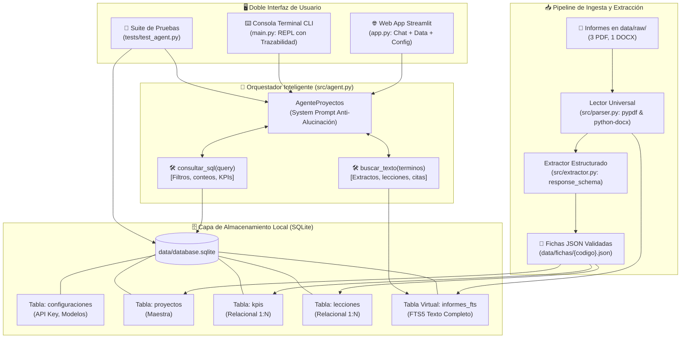

# 💼 Agente de Consulta de Proyectos · Procesa Consultores
> **Sistema de Inteligencia Operativa y Consulta Documental Multi-Herramienta impulsado por Google Gemini, SQLite Relacional, FTS5 y Streamlit.**

---

## 1. 📌 Contexto de Negocio y Visión General
**"Procesa Consultores"** es una firma de consultoría especializada en optimización de procesos y mejora de eficiencia operativa. La firma ha ejecutado y cerrado con éxito cuatro proyectos emblemáticos documentados en informes heterogéneos (PDF y DOCX):

1. `Informe_Cierre_PC-2025-014_Cooperativa_Horizonte_Andino.pdf` *(Servicios financieros · Crédito)*
2. `Informe_Cierre_PC-2025-027_Plasticos_del_Pacifico.pdf` *(Manufactura · TPM y SMED en inyección)*
3. `Informe_Cierre_PC-2025-033_Clinica_Santa_Lucia.docx` *(Salud · Admisión y consulta externa)*
4. `Informe_Cierre_PC-2026-006_Supermercados_La_Canasta.pdf` *(Retail · Reposición y cadena de suministro)*

Este repositorio implementa una solución integral de Inteligencia Artificial que extrae la información técnica de los informes mediante el SDK oficial de **Google Gemini** con tipado estricto (**Pydantic**), la estructura y persiste en **SQLite** (tanto en tablas relacionales normalizadas como en índices de texto completo **FTS5**), y provee un agente orquestador con capacidad de **Function Calling**, trazabilidad transparente de herramientas ejecutadas, **cero alucinaciones** y doble interfaz: **Web (Streamlit)** y **Consola CLI (REPL)**.

---

## 2. 🏛️ Arquitectura del Sistema y Decisiones Técnicas

### Diagrama de Arquitectura de la Solución


### Justificación de Decisiones Técnicas

| Decisión Técnica | Alternativas Evaluadas | Justificación de Ingeniería |
| :--- | :--- | :--- |
| **SQLite Relacional** | PostgreSQL, MySQL, DuckDB | Cero dependencia de infraestructura o servicios externos; despliegue inmediato en local o portátiles de consultores; soporte nativo para transacciones ACID, integridad referencial con `PRAGMA foreign_keys = ON;` y eliminación en cascada. |
| **SQLite FTS5** | Vector DBs (Chroma, Pinecone, Milvus) | Para portafolios de consultoría cerrados (~4 a 100 proyectos), FTS5 ofrece velocidad milimétrica con ranking BM25, generación de snippets exactos, indexación léxica de acrónimos técnicos (OEE, SMED, TPM) y nulo costo de inferencia de embeddings ni latencia de red. |
| **Pydantic Structured Outputs** | Prompts libres con regex o JSON sin esquema | Garantiza tipado estricto al 100%, previene alucinaciones sintácticas, valida tipos numéricos (`duracion_semanas: int`) y categorías cerradas (`cumplimiento`, `tema`), posibilitando la serialización directa y segura a SQLite. |
| **Google Gemini (google-genai)** | OpenAI, Anthropic, Modelos locales | Gran ventana de contexto, SDK unificado de última generación, soporte nativo de Function Calling y Structured Outputs de alta precisión con costo por millón de tokens significativamente más económico. |
| **ConfigManager Híbrido** | Archivos `.env` estáticos o hardcoding | Permite a usuarios no técnicos ingresar su API Key y elegir modelo directamente desde la interfaz gráfica web en SQLite, con fallback automático a variables de entorno para entornos CI/CD y despliegues headless. |

---

## 3. 📋 Justificación de los Campos de la Ficha Técnica

Cada campo de `FichaProyecto` en [`src/models.py`](file:///c:/Users/edwal/Downloads/Prueba%20Valor/Agente_de_Proyectos/src/models.py) responde a una necesidad de negocio concreta para el consultor:

| Campo | Tipo | Valor Agregado para el Consultor / Negocio |
| :--- | :--- | :--- |
| `codigo_proyecto` | `str` (PK) | Identificador unívoco corporativo (ej. `PC-2025-027`) para indexación relacional y trazabilidad de auditoría. |
| `archivo_origen` | `str` | Cita documental obligatoria para validación cruzada y verificación legal de entregables. |
| `cliente` & `cliente_descripcion` | `str` | Contexto de escala operativa (número de plantas, agencias, camas hospitalarias o locales comerciales) para evaluar comparabilidad. |
| `sector` | `str` | Segmentación de industria para búsquedas cruzadas y benchmarking inter-sectorial. |
| `ubicacion` | `str` | Relevancia geográfica (logística, clima, normativas locales). |
| `periodo` & `duracion_semanas` | `str` / `int` | Estimación de esfuerzo, velocidad de ejecución y plazos típicos para estructurar nuevas propuestas comerciales. |
| `gerente_proyecto` & `contraparte_cliente` | `str` | Mapa de capital intelectual interno y contrapartes para referencias cruzadas. |
| `estado` & `fecha_aceptacion` | `str` | Estado contractual vinculante (ej. 'Cerrado aceptado' vs 'Cerrado con pendientes'). |
| `resumen_ejecutivo` | `str` | Síntesis ejecutiva de alto impacto para directores y comités. |
| `diagnostico_problema` | `str` | Línea base del dolor de negocio para identificar patrones recurrentes de ineficiencia. |
| `alcance_incluido` | `str` | Delimitación técnica de procesos y líneas efectivamente transformadas. |
| **`alcance_excluido`** | `str` | **Campo crítico anti-alucinación.** Evita asumir intervenciones en líneas o áreas que no formaron parte del proyecto (ej. Línea 2 de soplado en Plásticos del Pacífico, hospitalización en Clínica Santa Lucía o hipotecario en Horizonte Andino). |
| `metodologia` | `str` | Catálogo de herramientas aplicadas (Lean, TPM, SMED, Teoría de Colas, VSM) para replicabilidad metodológica. |
| `iniciativas_clave` | `List[Iniciativa]` | Inventario granular de entregables funcionales implementados en piso/operación. |
| `kpis` | `List[MetricaKPI]` | Métricas duras cuantitativas (Línea base, Meta, Resultado, Variación, Cumplimiento) para sustentar el ROI en futuras licitaciones. |
| `lecciones` | `List[LeccionAprendida]` | Repositorio de retrospectiva (Gestión del cambio, Calidad de datos, Terceros) para no cometer los mismos errores. |
| `proximos_pasos` | `List[str]` | Detección de oportunidades de venta cruzada (Fases 2) para el equipo comercial. |

---

## 4. 🎯 Criterios de Fiabilidad de Datos y Gestión de Discrepancias Documentales

En proyectos de consultoría estratégica y auditoría de procesos, los informes de cierre contienen múltiples capas de información (tablas oficiales de cierre, narrativas ejecutivas, notas al pie, anexos operacionales y mediciones intermedias). Para garantizar **cero alucinaciones, consistencia matemática y trazabilidad fidedigna**, el sistema implementa las siguientes reglas universales de gobernanza de datos:

### 1. Regla de Prevalencia de la Tabla Oficial de Cierre
* **Principio Rector:** La **tabla oficial de resultados del informe de cierre** constituye la verdad formal y contractual aceptada por el cliente. Prevalece inequívocamente sobre cualquier borrador, anexo técnico o medición preliminar.
* **Medición Preliminar vs. Cierre Definitivo (Caso Clínica Santa Lucía `PC-2025-033`):**
  - *Contexto:* El texto del informe menciona una medición preliminar en diciembre de 2025 que arrojó una reducción del **30%** en el tiempo de espera.
  - *Resolución del Sistema:* La herramienta y el agente toman de forma estricta el resultado de cierre: **reducción del 24%** (tiempo final: 39,5 min frente a línea base de 52 min). Esta medición fue formalizada en febrero de 2026 e incorporó la estacionalidad de mayor demanda por inicio de clases escolares. El valor del 30% se conserva como insight de contexto en la narrativa, pero la métrica relacional oficial y vinculante es `-24%`.
* **Anexos Técnicos vs. Tabla Oficial (Caso Plásticos del Pacífico `PC-2025-027`):**
  - *Contexto:* El *Anexo A* ("Principales causas de parada en la línea base") desglosa horas por fallas mecánicas, atascos, falta de material y ajustes, cuya sumatoria bruta asciende a 84 h/mes (o 122 h/mes si se sumaran los cambios de formato). Sin embargo, la tabla oficial de indicadores de la Sección 7.2 establece una línea base de **64 h/mes**.
  - *Resolución del Sistema:* Como regla general, **cuando un anexo no coincide con la tabla oficial de resultados, prevalece la tabla**. El sistema toma como línea base oficial **64 h/mes**, ya que sobre este valor exacto se calcularon la meta ($\le 38$ h/mes), el resultado alcanzado ($31$ h/mes) y la variación porcentual contractual ($-52\% = -33/64$). El anexo se presenta como desglose cualitativo para comprender las causas raíz, pero no sustituye la base matemática oficial.

### 2. Aislamiento de Variables Externas y No Atribuibilidad (+9% de Colocación en `PC-2025-014`)
* *Contexto:* En el proyecto de la *Cooperativa Horizonte Andino*, el cliente reportó un incremento de **+9% en el monto colocado** de microcrédito y crédito de consumo entre el primer y segundo trimestre de 2025.
* *Resolución del Sistema:* **El +9% no debe registrarse como resultado del proyecto de consultoría.** El informe aclara que este aumento respondió a una campaña comercial del cliente ejecutada en paralelo.
* *Implementación:* El sistema excluye esta cifra de la tabla relacional de KPIs atribuibles (manteniendo únicamente los 5 indicadores de proceso: tiempo de aprobación, solicitudes con reproceso, productividad de analistas, satisfacción de socios y tasa de abandono). Si el usuario consulta sobre crecimiento de colocación, el agente lo reporta explícitamente como **dato de contexto no atribuible**, preservando la ética de atribución de la consultora.

### 3. Distinción Semántica: "Proyectos Cerrados" vs. "Cerrado con Pendientes"
* *Definición de "Proyectos Cerrados":* Cuando el enunciado o los directores hablan de "proyectos cerrados", se refieren a que **la fase de ejecución formal de los cuatro proyectos concluyó**.
* *Distinción de Estados de Aceptación:* El sistema no confunde la conclusión de la ejecución con una aceptación sin observaciones. Clasifica formalmente los proyectos en:
  - **Cerrado aceptado (3 proyectos):** `PC-2025-014` (Horizonte Andino), `PC-2025-027` (Plásticos del Pacífico) y `PC-2025-033` (Clínica Santa Lucía), los cuales obtuvieron firma formal de conformidad sin pendientes.
  - **Cerrado con pendientes (1 proyecto):** `PC-2026-006` (Supermercados La Canasta), cuya ejecución concluyó pero trasladó a Fase 2 la integración EDI con 3 proveedores debido al upgrade de versión del ERP (nov-2026) y la madurez técnica de un proveedor.

### 4. Transparencia en la Fuente Fiable y Reporte de Matices
El chatbot no oculta las discrepancias documentales ni las aplana de forma artificial. En su rol de Consultor Senior:
1. Declara primero la **cifra oficial fiable** extraída de la tabla de cierre de la base de datos relacional.
2. Explica el **matiz o detalle de la discrepancia** (medición preliminar transitoria, anexo de causas o factor no atribuible).
3. Cita la **fuente documental exacta** con su nombre de archivo íntegro entre corchetes `[Fuente: ...]`.

---

## 5. 🚀 Guía de Instalación y Ejecución

### Prerrequisitos
- Python 3.10 o superior (verificado en Python 3.14).
- Git instalado.

### Paso 1: Clonar y Navegar al Repositorio
```bash
git clone <URL_DEL_REPOSITORIO>
cd Agente_de_Proyectos
```

### Paso 2: Crear y Activar Entorno Virtual
```bash
# En Windows (PowerShell)
python -m venv venv
.\venv\Scripts\Activate.ps1

# En Linux / macOS
python3 -m venv venv
source venv/bin/activate
```

### Paso 3: Instalar Dependencias
```bash
pip install -r requirements.txt
```

### Paso 4: Configurar Variables de Entorno (Opcional)
Puedes crear un archivo `.env` basado en la plantilla:
```bash
cp .env.example .env
```
*(Nota: También puedes ingresar tu `GEMINI_API_KEY` directamente en la interfaz gráfica de Streamlit y quedará guardada en la base de datos SQLite).*

---

## 6. 💻 Modos de Uso

### A. Interfaz Gráfica Web (Streamlit)
Inicia la aplicación web interactiva con:
```bash
streamlit run app.py
```
**Características de la UI:**
- **Sidebar & Configuración:** Gestión de API Key en SQLite, selector de modelos (`gemini-3.8-flash`, `gemini-3.5-flash`, `gemini-1.5-pro`), selector de temperatura y botón de re-procesamiento.
- **Pestaña Chatbot Consultor:** Chat conversacional con expander de trazabilidad de herramientas utilizadas (`[TOOL CALL]`) y resaltado visual de citas documentales (`[Fuente: ...]`).
- **Pestaña Explorador BD:** Tablas interactivas de Proyectos, KPIs y Lecciones con filtros dinámicos y visor de fichas JSON con botón de descarga.
- **Pestaña Configuraciones:** Visualización de parámetros persistidos en SQLite.

### B. Interfaz por Consola CLI (main.py)
Inicia el bucle interactivo de terminal con:
```bash
python main.py
```
**Ejemplo de interacción por consola:**
```text
Consultor > ¿Cuál fue el OEE de Plásticos del Pacífico?

[TOOL CALL] -> Herramienta: consultar_sql | Args: {"query": "SELECT codigo_proyecto, indicador, linea_base, meta, resultado, variacion, cumplimiento, observaciones FROM kpis WHERE codigo_proyecto = 'PC-2025-027' AND indicador LIKE '%OEE%';"}
[TOOL RESULT] -> 1 fila(s) obtenida(s).

[RESPUESTA]:
En el proyecto de Plásticos del Pacífico S.A. (PC-2025-027), el indicador de OEE de la Línea 1 registró una línea base de 58%, con una meta de al menos 70%, alcanzando un resultado final de 71% (variación de +13 puntos porcentuales), catalogado como Cumplido.

Cabe destacar que este cálculo corresponde exclusivamente a la Línea 1 de inyección, habiendo quedado la Línea 2 de soplado expresamente fuera del alcance del proyecto.

[Fuente: Informe_Cierre_PC-2025-027_Plasticos_del_Pacifico.pdf]
---------------------------------------------------------------------------
Consultor > salir
👋 Sesión finalizada. ¡Hasta pronto!
```

### C. Servidor MCP (Model Context Protocol) & Integración Multi-Cliente

El proyecto incluye una implementación nativa de **Model Context Protocol (MCP)** en [`src/mcp_server.py`](file:///c:/Users/edwal/Downloads/Prueba%20Valor/Agente_de_Proyectos/src/mcp_server.py), permitiendo que cualquier cliente de IA compatible consuma las herramientas `consultar_sql` y `buscar_texto` como extensiones nativas.

#### 🔄 ¿Cómo funciona el Auto-Levantamiento? (Zero-Config / Sin Múltiples Instancias)
En la arquitectura oficial de MCP sobre transporte estándar `stdio` (entrada/salida estándar), **los clientes son los encargados de levantar y gestionar el ciclo de vida del servidor de manera 100% automática**:
- **Sin puertos ocupados:** No se abren puertos TCP ni servidores HTTP que puedan colisionar con Streamlit o servicios locales.
- **Sin procesos huérfanos:** Cuando abres **Claude Desktop**, **Cursor IDE** o ejecutas el script de prueba, el cliente inicia `python src/mcp_server.py` como un subproceso hijo en segundo plano. Cuando el cliente se cierra o la consulta concluye, el servidor MCP se apaga de forma limpia y transparente.
- **Conexión en Streamlit:** La aplicación web incluye la pestaña **`🔌 Servidor MCP`**, permitiendo ejecutar diagnósticos en vivo y copiar las rutas absolutas configuradas para tu entorno.

#### 1. Probar con el Script Cliente de Google Gemini (`test_mcp_client.py`)
Puedes verificar la interacción completa entre Gemini y el servidor MCP ejecutando:
```bash
python test_mcp_client.py "¿Cuáles son los 4 proyectos y qué sectores tienen?"
```

**Flujo de ejecución:**
1. Inicia el subproceso del servidor MCP (`src/mcp_server.py`) mediante transporte `stdio`.
2. Descubre dinámicamente las herramientas expuestas (`consultar_sql`, `buscar_texto`).
3. Envía el prompt al SDK oficial de **Google Gemini** vinculando las herramientas MCP.
4. Gemini decide qué herramienta utilizar, ejecuta el Tool Call a través del protocolo MCP, recibe las filas de SQLite y sintetiza la respuesta final.

#### 2. Configuración en Claude Desktop
Añade la siguiente entrada en tu archivo de configuración (`%APPDATA%\Claude\claude_desktop_config.json` en Windows o `~/Library/Application Support/Claude/claude_desktop_config.json` en macOS):
```json
{
  "mcpServers": {
    "procesa-consultores": {
      "command": "python",
      "args": [
        "c:\\Users\\edwal\\Downloads\\Prueba Valor\\Agente_de_Proyectos\\src\\mcp_server.py"
      ]
    }
  }
}
```

#### 3. Configuración en Cursor IDE o Windsurf
Crea o edita el archivo `.cursor/mcp.json` en la raíz de tu proyecto o agrégalo en *Cursor Settings > Features > MCP*:
```json
{
  "mcpServers": {
    "procesa-consultores": {
      "command": "python",
      "args": [
        "c:\\Users\\edwal\\Downloads\\Prueba Valor\\Agente_de_Proyectos\\src\\mcp_server.py"
      ]
    }
  }
}
```
Al reiniciar el editor, aparecerá el ícono del martillo/herramientas 🛠️ con `consultar_sql` y `buscar_texto` activas para que el asistente consulte la base de datos SQLite en lenguaje natural.

---

## 7. 🧪 Suite de Pruebas Automatizadas (Pytest)

Ejecuta la batería completa de 14 pruebas automatizadas (integridad relacional, anti-alucinaciones, herramientas y protocolo MCP):

```bash
python -m pytest tests/ -v
```

### Casos de Prueba Incluidos:
1. `test_existencia_cuatro_proyectos`: Verifica que exactamente los 4 proyectos estén cargados en SQLite.
2. `test_exactitud_kpi_oee_plasticos`: Verifica OEE (Línea base 58%, Resultado 71%, Cumplido) y citación del informe.
3. `test_estado_no_cumplido_proveedores_la_canasta`: Valida el estado "No cumplido" para integración de proveedores.
4. `test_reduccion_tiempo_espera_clinica_santa_lucia`: Valida reducción oficial al 24% en tiempos de espera de consulta externa.
5. `test_validacion_anti_alucinacion_cliente_inexistente`: Consulta sobre cliente inexistente valida respuesta estándar.
6. `test_seguridad_sql_rechaza_escritura`: Comprueba el rechazo de sentencias `DROP`, `DELETE` o `INSERT`.
7. `test_persistencia_configuraciones`: Comprueba la persistencia y lectura en la tabla `configuraciones`.
8. `test_linea_base_paradas_64h_prevalece_sobre_anexo`: Comprueba prevalencia de la tabla oficial de resultados (64 h/mes).
9. `test_no_atribuibilidad_colocacion_horizonte_andino`: Comprueba no atribuibilidad del +9% en colocación.
10. `test_distincion_cerrado_con_pendientes_vs_cerrados`: Comprueba distinción de estado "Cerrado con pendientes".
11. `test_alcance_excluido_emergencia_santa_lucia`: Valida declaración formal de exclusión de Emergencias y Quirófanos.
12. `test_anti_alucinacion_honorarios_no_documentados`: Valida cero alucinación ante datos financieros no documentados.
13. `test_mcp_server_tools_registration`: Valida el inicio del servidor MCP y registro de `consultar_sql` y `buscar_texto`.
14. `test_mcp_server_tool_execution`: Valida la ejecución y retorno de queries sobre SQLite a través del protocolo MCP.

---

## 8. ⚠️ Supuestos y Limitaciones Conocidas

1. **Extracción de Texto:** El lector universal asume documentos digitales con capa de texto legible (PDFs nativos generados por procesadores de texto y archivos DOCX). En caso de informes escaneados como imagen plana, se requeriría incorporar un motor OCR (como Tesseract o Google Cloud Vision).
2. **Concurrencia de Escritura SQLite:** SQLite opera de manera óptima en modo lectura multi-hilo; sin embargo, las escrituras masivas concurrentes bloquean la base de datos brevemente. En un entorno de producción masivo (>1.000 usuarios concurrentes escribiendo), se recomienda habilitar el modo WAL (`PRAGMA journal_mode=WAL;`) o migrar la capa de persistencia a PostgreSQL.
3. **Límites de Cuota por Minuto (RPM):** En planes gratuitos de Google AI Studio, las llamadas estructuradas pueden experimentar límites de cuota si se reprocesan decenas de archivos simultáneamente. El pipeline implementa serialización y caching en `data/fichas/` para evitar re-extracciones redundantes.

---

## 9. 💰 Modelo de Estimación de Costos (50 Consultores)

### Escenario de Uso y Supuestos Operativos
- **Equipo de consultoría:** 50 consultores activos.
- **Volumen de consultas:** 6 consultas diarias por consultor = **300 queries/día**.
- **Jornada mensual:** 22 días hábiles = **6.600 queries/mes**.

### Consumo Estimado de Tokens por Consulta
- **Tokens de Entrada (Prompt + Esquema DB + Historial + Resultados Tool):** ~2.000 tokens / query.
- **Tokens de Salida (Respuesta estructurada en lenguaje natural y citas):** ~400 tokens / query.
- **Total Mensual Input:** 6.600 × 2.000 = 13.200.000 tokens (**13,2 M tokens**).
- **Total Mensual Output:** 6.600 × 400 = 2.640.000 tokens (**2,64 M tokens**).

---

### Tarifario y Comparativa de Costos por Modelo de API

| Concepto | Gemini 2.5 / 1.5 Flash | Gemini 3.5 Flash *(Proyectado)* | Gemini 3.8 Flash *(High-Capacity)* | Gemini 1.5 / Pro *(Tier Avanzado)* |
| :--- | :--- | :--- | :--- | :--- |
| **Tarifa Input (por 1M tokens)** | $0,075 USD | $0,100 USD | $0,150 USD | $1,250 USD |
| **Tarifa Output (por 1M tokens)** | $0,300 USD | $0,400 USD | $0,600 USD | $5,000 USD |
| **Costo Mensual Input (13,2 M)** | $0,99 USD | $1,32 USD | $1,98 USD | $16,50 USD |
| **Costo Mensual Output (2,64 M)** | $0,79 USD | $1,06 USD | $1,58 USD | $13,20 USD |
| **COSTO TOTAL MENSUAL (50 usuarios)** | **$1,78 USD / mes** | **$2,38 USD / mes** | **$3,56 USD / mes** | **$29,70 USD / mes** |
| **Costo promedio por consultor / mes** | **$0,036 USD** | **$0,048 USD** | **$0,071 USD** | **$0,594 USD** |

---

### Análisis y Recomendación Estratégica

1. **Modelo de Producción Predeterminado (Gemini 2.5 / 3.5 Flash):**
   - Para flujos estándar de Function Calling (traducción a SQL y búsquedas FTS5), la serie Flash mantiene un costo mensual total inferior a **$2,50 USD para toda la organización**.
   - Garantiza tiempos de respuesta inferiores a 1 segundo por interacción sin penalizar el presupuesto operativo.

2. **Modelo de Mayor Contexto / Capacidad (Gemini 3.8 Flash):**
   - Representa un punto de equilibrio óptimo (~**$3,56 USD/mes**) si se incrementa la ventana de contexto para procesar múltiples informes consolidados simultáneamente o documentos con anexos densos.

3. **Modelo de Escalado Analítico (Gemini Pro):**
   - Configurable directamente desde la interfaz web (Streamlit) mediante la tabla de `configuraciones`.
   - Se reserva bajo demanda para consultas que requieran razonamiento multidocumento complejo, correlación transversal de lecciones aprendidas o generación de síntesis ejecutivas extensas, manteniendo un techo controlado de **~$30 USD mensuales**.
